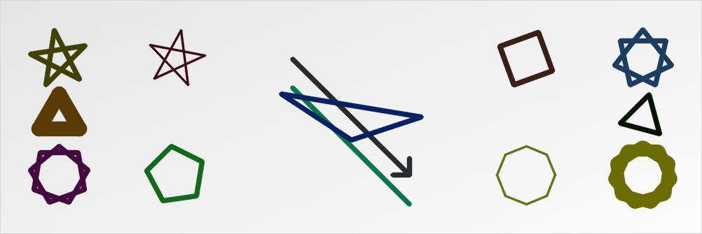

# PyHelper
This is module a set of helper functions for OpenCV, ImageProcessing, ComputerVision and Python.

## Draw Helper
### Draw Star and Triangle

~~~python
import cv2
import scripts.drawHelper as drw
import scripts.osHelper as osh
from scripts.colorHelper import *

dir = osh.getPath(__file__)
im = cv2.imread(dir+r'/media/im.png')

h, w = im.shape[:2]
f, ox, oh, cx, cy = 2.5, w/12, h/4, w/2, h/2
rc = randomDarkColors

drw.drawLine(im, (cx-ox, cy-oh), (cx+ox, cy+oh), color=rc(), hasArrow=True)
drw.drawLine(im, (cx-ox, cy-oh+oh/2), (cx+ox, cy+oh+oh/2),
             color=rc(), hasArrow=False)
drw.drawPoly(im, [(w/f, h/f), (w-w/f, h/2), (w/2, h-h/f)], color=rc())

drw.drawStar(im, (ox, oh), oh/2, color=rc(), rotation=45)
drw.drawStar(im, (w-ox, oh), oh/2, color=rc(), points=7)

drw.drawStar(im, (ox*3, oh), oh/2, color=rc(), rotation=65, thickness=2)
drw.drawStar(im, (w-ox*3, oh), oh/2, color=rc(), points=8, rotation=25)

drw.drawStar(im, (ox, h-oh), oh/2, color=rc(), points=9)
drw.drawStar(im, (w-ox, h-oh), oh/2, color=rc(), points=11, thickness=15)

drw.drawHomogeneousPoly(im, (ox*3, h-oh), oh/2,
                        color=rc(), points=5, rotation=45)
drw.drawHomogeneousPoly(im, (w-ox*3, h-oh), oh/2,
                        color=rc(), points=8, thickness=2)

drw.drawTriangle(im, (ox, h/2), oh/f, color=rc(), thickness=20)
drw.drawTriangle(im, (w-ox, h/2), oh/f, color=rc(), rotation=45)
~~~

### Draw Multiline
~~~python
pts = [(ox-ox/2, oh), (ox*2-ox/2, oh), (ox*3-ox/2, oh/2), (ox*4-ox/2, oh+oh/2)]
drw.drawMultiLine(im, pts, color=rc(), arrowType=drw.MULTILINE_ARROW_NONE)

pts = [(ox-ox/2, h/2), (ox*2-ox/2, h/2-oh/2), (ox*3-ox/2, h/2+oh/2), (ox*4-ox/2, h/2+oh)]
drw.drawMultiLine(im, pts, color=rc(), arrowType=drw.MULTILINE_ARROW_END)

pts = [(ox-ox/2, h-oh-oh/6), (ox*2-ox/2, h-oh-oh/4), (ox*3-ox/2, h-oh/4), (ox*4-ox/2, h-oh/2)]
drw.drawMultiLine(im, pts, color=rc(), arrowType=drw.MULTILINE_MULTIPLE_ARROW)
~~~

### Draw Circles and Arcs
~~~python
drw.drawCircle(im,(cx-cx/1.6,cy),h/8,color=rc(),thickness=1,angle=180,rotation=0)
drw.drawCircle(im,(cx-cx/1.6,cy),h/5,color=rc(),thickness=10,angle=90,rotation=-90)
drw.drawCircle(im,(cx-cx/1.6,cy),h/3,color=rc(),thickness=45,angle=270,rotation=-180)

drw.drawCircle(im,(cx,cy),h/8,color=rc(),thickness=1)
drw.drawCircle(im,(cx,cy),h/5,color=rc(),thickness=10)
drw.drawCircle(im,(cx,cy),h/3,color=rc(),thickness=45)

drw.drawCircle(im,(cx+cx/1.6,cy),h/8,color=rc(),endLastLine=False,thickness=1,angle=180,rotation=0)
drw.drawCircle(im,(cx+cx/1.6,cy),h/5,color=rc(),endLastLine=False,thickness=10,angle=90,rotation=-90)
drw.drawCircle(im,(cx+cx/1.6,cy),h/3,color=rc(),endLastLine=False,thickness=45,angle=270,rotation=-180)
~~~

## OS Helper

## Color Helper
~~~python
from scripts.colorHelper import *

print(randomColor(min=0, max=255))
print(randomLightColors())
print(randomDarkColors())
~~~

>>(135, 231, 232)  

>>(251, 207, 165)  

>>(5, 121, 79)

## Math Helper

## Array Helper

## Font Helper

## Future works
- [x] Draw arc
- [ ] Add a simple vector font, something that i can rotate, sheer, resize and ...
- [ ] Draw shaped line, dashed line, dotted line in every draw function
- [ ] Draw bullet and other markers on every point of multiline function

## License
**This library is licensed by MIT. But used modules, including OpenCV and Python, may have other licenses. Then; To use, consider the licenses of those modules.**