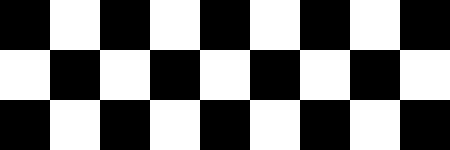

# PyHelper
This module is a set of helper functions for ImageProcessing and ComputerVision.

## Draw Functions
### Draw Chess Grid
~~~python
import scripts.nsdraw as draw
im = draw.grid(im)
~~~

**Parameters**  
- **im:** numpy.ndarray  
- **color1:** tuple  
- **color2:** tuple  
- **thickness:** int  

### Draw Star

~~~python
import scripts.nsdraw as draw

draw.triangle(im, (100, 100), 50, color=(0,0,0), rotation=-90)
~~~

### Draw Homogeneous Polygon

~~~python
import scripts.nsdraw as draw

draw.hPoly(im, (100,100), 50, color=(0,0,0), rotation=-90)
~~~

### Draw Triangle
~~~python
import scripts.nsdraw as draw

draw.triangle(im, (100,100), 50, color=(0,0,0), rotation=-90)
~~~

### Draw Line, Arrow and Multiline
~~~python
import scripts.nsdraw as draw

draw.line(im, (240, 307), (330, 40), color=(0,0,0))
# or
pts = [(418, 303), (461, 195),  (539, 140), (520, 40)]
draw.multiline(im, pts, color=(0,0,0), arrowType=drw.MULTILINE_ARROW_NONE)
~~~
arrowType= drw.MULTILINE_ARROW_NONE   
arrowType= drw.MULTILINE_ARROW_END   
arrowType= drw.MULTILINE_MULTIPLE_ARROW   

### Draw Circles and Arcs
~~~python
import scripts.nsdraw as draw

draw.circle(im, (100, 100), 50, color=rc(), thickness=2, arc=180, rotation=0)
~~~

## Math
|FIXME|

## Array
|FIXME|

## Font
|FIXME|

## Future works
- [ ] Draw arc
- [ ] Make a font and font-wrapper
- [ ] Add a simple vector font, something that i can rotate, sheer, resize and ...
- [ ] Draw shaped line, dashed line, dotted line in every draw function
- [ ] Draw bullet and other markers on every point of multiline function
- [ ] Make a simpler structure for put small image in big image
- [ ] Make a simpler structure for rotate and transform images
- [ ] Make a simple tool to find HSV range
- [ ] Make a simple FeatureMatcher
- [ ] Add some features to console table maker
- [ ] Make 3D renderer for image slices

## License
License of this repository [LICENSE](/LICENSE).

NOTICE: In this project, two different modules are used as backend. Please consider the licenses of these two modules before using this repository.
[OpenCV](https://github.com/opencv), [NumPy](https://numpy.org/about/)